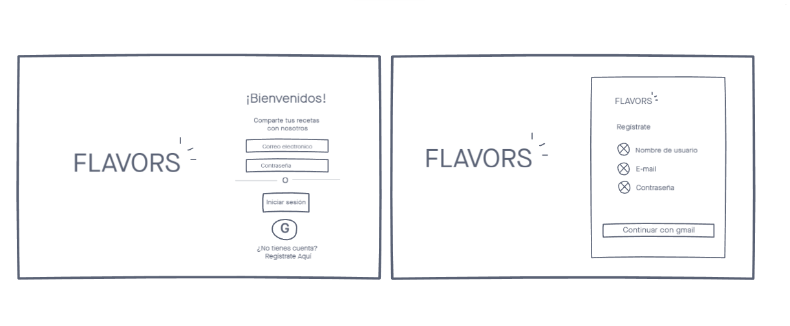
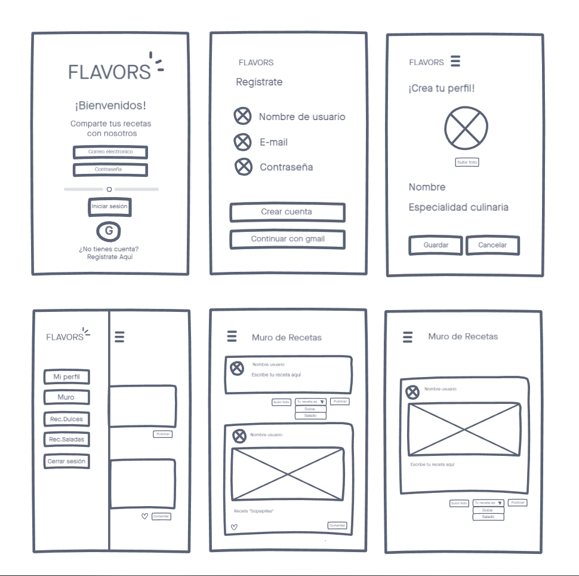

# Red Social Flavors

## Índice 

* [1. Definición del producto](#1-definicion-del-producto)
* [2. Historias de usuario](#2-historias-de-usuario)
* [3. Planificación y diseño](#3-planificacion-y-diseño)
* [4. Decisiones de diseño](#4-decisiones-de-diseño)
* [5. Testeos de usabilidad](#5-testeos-de-usabilidad)
* [6. Proyecto finalizado](#6-proyecto-finalizado) 

***

## 1. Definición del producto

***

Flavors es una red social para encontrar y compartir recetas que vayan acorde a nuestros gustos culinarios del día a día. 

### A quien va dirigido

Esta red social va dirigida a los amantes de la cocina que quieran compartir o buscar recetas y hacer recomendaciones culinarias a otros usuarios.

### Problemática

Muchas veces nos encontramos en situaciones donde no sabemos qué cocinar, queremos compartir con el mundo nuestra creación, o queremos tener una especie de glosario de nuestras recetas que muchas veces se pierden entre papeles o distintos lugares de almacenaje.

### Como crees que el producto que estás creando está resolviendo sus problemas:

A veces uno suele tener recetas predeterminadas en la mente y nunca está de más conocer nuevas formas de probar nuevas técnicas, también puede ser utilizada para almacenar tus recetas y acceder a ellas con facilidad.

***

## 2. Historias de usuario

***

Utilizamos las historias de usuario como el instrumento principal para identificar los requerimientos de usuario.

__Historia 1__  

Yo _como_ usuario _quiero_ poder crear una cuenta para _poder_ subir mis recetas.

#### Criterios de aceptación:

* El usuario puede crearse una cuenta con su correo electrónico o acceder desde una cuenta de google.
* Solamente se permite el acceso a usuarios con cuentas válidas.
* El nombre de usuario es único
* La cuenta de usuario debe ser un correo electrónico válido.
* Lo que se escriba en el campo (input) de contraseña debe ser secreto.

__Historia 2__

Yo _como_ usuario _quiero_ ver un menú donde pueda desplazarme fácilmente _para_ acceder a las diferentes pantallas de la red social.

#### Criterios de aceptación:

* El usuario puede acceder a un menú desplegable.
* Debe contar con las opciones de mi perfil, recetario y cerrar sesión.

__Historia 3__

Yo _como_ usuario _quiero_ poder cerrar sesión en mi cuenta después de haber interactuado _para_ reingresar en otro momento.

#### Criterios de aceptación:

* El usuario puede cerrar sesión desde el botón que se encuentra en el menú desplegable.
* Al cerrar sesión se redirige al login.

__Historia 4__

Yo _como_ usuario _quiero_ editar mi perfil _para_ que me reconozcan fácilmente.

#### Criterios de aceptación:

* El usuario puede cambiar su nombre de perfil.
* El usuario puede editar el perfil cada vez que lo desee. 
* Debe poder editar perfil al presionar el botón “Mi perfil” que aparece en el menú desplegable.

__Historia 5__

Yo _como_ usuario _quiero_ poder postear mi receta _para_ que otros usuarios puedan utilizarlas.

#### Criterios de aceptación:

* El usuario puede crear un post y publicarlo.
* El post se imprime en el timeline y queda guardado.

***

## 3 Planificación y Diseño

***

Para el proceso de planificación y diseño se utilizaron las siguientes herramientas:  

- Trello: Nos permitió mantener el orden en el proceso de producción, a través del desarrollo de historias de usuario con la determición del criterio de aceptación y la definición de terminado. Puedes ver nuestro Trello pinchando [AQUÍ](https://trello.com/b/idYtfKM1/redsocial).
- Diagramas de flujo: Diagrama que permitió definir el flujo que debía seguir el usuario al ingresar a la página web.
- invision: Interfaz de diseño que permitió realizar el prototipo de baja fidelidad.
- Figma: Interfaz de diseño colaborativa que permitió desarrollar el prototipo de alta fidelidad.

### **Prototipo de Baja Fidelidad**

***

### **Prototipo de Alta Fidelidad**

### **Prototipo de Alta Fidelidad versión Mobile**

***

## 4. Decisiones de diseño

*** 

Con respecto a las decisiones de diseño, se opto por utilizar una paleta de colores calidos, predominando el color naranjo, el cual según su psicología transmite alegría, emoción que nos hace sentir la comida; con respecto a la tipografía se utilizó la fuente Comfortaa, la cual es legible en diferentes tamaños, lo que ayuda a ser más amena la lectura de nuestras recetas.

*** 

## 5. Testeos de usabilidad
 
***

Se testearon a 4 usuarios, los cuales si bien entendían la interfaz de nuestra aplicación y les gustaba el contraste de los colores, nos hicieron las siguientes sugerencias:

- Quitar el botón de google de la pantalla "Regístrate", ya que este estaba presente en la pantalla principal, y consideraba que no era necesario repetirlo.
- Unificar los colores de los botones.
- Diferenciar mediante colores el post cuando el usuario estaba escribiendo y cuando ya había sido realizada su publicación.
- Utilizar iconos para ser más amenos los post.

***

## 6. Proyecto finalizado

***

Si quieres ver el proyecto final pincha [AQUÍ](https://nadiagincoff.github.io/SCL013-social-network/src/index.html)
***
